# 🌟 Cognio Labs - Agentic AI Project Template

```mermaid
flowchart TD
    subgraph "⚡ COGNIO LABS ⚡"
        A["🤖 Agentic AI Template"]
        B["🚀 FastAPI + LangGraph + Next.js"]
        C["🐳 Docker Ready"]
    end
    
    style A fill:#e1f5fe,stroke:#01579b,stroke-width:2px
    style B fill:#f3e5f5,stroke:#4a148c,stroke-width:2px
    style C fill:#e8f5e8,stroke:#1b5e20,stroke-width:2px
```

<div align="center">




**A production-ready template for building sophisticated AI agent systems**

[](https://python.org)
[](https://fastapi.tiangolo.com)
[](https://nextjs.org)
[](https://docker.com)
[](https://github.com/langchain-ai/langgraph)

</div>

---

## 🎯 What is this Template?

**Cognio Labs Agentic AI Template** is a comprehensive, production-ready foundation for building sophisticated AI agent systems. This template eliminates the complexity of setting up modern AI applications by providing a pre-configured, scalable architecture that integrates:

- **🧠 Advanced AI Agents** powered by LangGraph orchestration
- **⚡ High-Performance Backend** with FastAPI and async operations  
- **🎨 Modern Frontend** with Next.js and TypeScript
- **🐳 Containerized Deployment** with Docker Compose
- **📊 Real-time Visualization** with Streamlit integration
- **🔍 Comprehensive Tracing** with LangSmith/LangFuse

### 🚀 Why Use This Template?

Instead of spending weeks setting up infrastructure, focus on what matters: **building amazing AI experiences**. This template provides:

- **⏱️ Rapid Prototyping**: Get from idea to working prototype in minutes
- **🏗️ Production Architecture**: Scalable, maintainable, and deployment-ready
- **🔧 Best Practices**: Pre-configured with industry standards and conventions
- **📈 Observability**: Built-in tracing, monitoring, and debugging tools
- **🎯 Flexibility**: Support for multiple LLM providers and agent architectures

---

## 📋 Project Creation Requirements

Based on the **Cognio Labs Project Creation Template**, every project built from this template should include:

### 🛠️ Core Components Required

| Component | Purpose | Implementation |
|-----------|---------|----------------|
| **1. LangGraph for Agents** | Agent orchestration and workflow management | `backend/agents/` + `backend/langgraph_flows/` |
| **2. Streamlit Demo Visualization** | Single-file demo showcasing agent capabilities | `backend/demo.py` with LangGraph integration |
| **3. LangSmith/LangFuse Tracing** | Agent monitoring, prompt tracking, and RAG debugging | Integrated throughout agent flows |
| **4. React/Next.js Frontend** | Modern, responsive user interface | `frontend/` with TypeScript and component library |
| **5. FastAPI Backend** | RESTful API with modular route organization | `backend/api/` with organized endpoint structure |
| **6. Docker Deployment** | Full containerized application stack | `docker-compose.yml` with multi-service orchestration |

### 🎯 Success Criteria

✅ **Functional Demo**: Complete working application accessible via Docker  
✅ **Agent Traceability**: All agent interactions visible in tracing dashboard  
✅ **Modular Architecture**: Clean separation of concerns and reusable components  
✅ **Production Ready**: Environment configuration, error handling, and logging  
✅ **Documentation**: Clear setup instructions and architecture overview  

---

## 🏗️ Architecture Overview


---

## 🚀 Quick Start Guide

### Prerequisites
- **Docker & Docker Compose** (recommended)
- **Python 3.12+** (for local development)
- **Node.js 18+** (for frontend development)
- **API Keys** for your chosen LLM providers

### 🐳 Docker Setup (Recommended)

1. **Clone and Configure**
   ```bash
   git clone https://github.com/Cognio-so/cognio-template.git your-project-name
   cd your-project-name
   cp .env.example .env
   # Edit .env with your API keys
   ```

2. **Launch the Full Stack**
   ```bash
   docker-compose up --build
   ```

3. **Access Your Application**
   - 🌐 **Frontend**: http://localhost:3000
   - 🔧 **Backend API**: http://localhost:8000
   - 📚 **API Docs**: http://localhost:8000/docs
   - 📊 **Streamlit Demo**: http://localhost:8501

### 💻 Local Development Setup

<details>
<summary>Click to expand local development instructions</summary>

**Backend Setup:**
```bash
cd backend
uv install -e .
uvicorn main:app --reload
```

**Frontend Setup:**
```bash
cd frontend
npm install
npm run dev
```

**Streamlit Demo:**
```bash
cd backend
streamlit run demo.py
```

</details>

---

## 📁 Project Structure

```
cognio-template/
├── 🔧 backend/                    # FastAPI Backend
│   ├── agents/                   # Agent definitions & orchestration
│   ├── prompts/                  # Modular prompt templates
│   ├── langgraph_flows/          # LangGraph workflows
│   ├── api/                      # FastAPI endpoints & routers
│   ├── core/                     # Core utilities & configurations
│   ├── models/                   # Pydantic models
│   ├── services/                 # Business logic services
│   ├── demo.py                   # Streamlit demo application
│   ├── pyproject.toml            # Python dependencies
│   ├── Dockerfile                # Backend container config
│   └── main.py                   # FastAPI entry point
├── 🎨 frontend/                   # Next.js Frontend
│   ├── src/
│   │   ├── components/           # Reusable React components
│   │   ├── pages/                # Next.js pages
│   │   ├── hooks/                # Custom React hooks
│   │   ├── utils/                # Utility functions
│   │   └── types/                # TypeScript definitions
│   ├── package.json              # Node.js dependencies
│   ├── Dockerfile                # Frontend container config
│   └── next.config.js            # Next.js configuration
├── 📚 guides/                     # Documentation & guides
├── 🐳 docker-compose.yml         # Multi-container orchestration
├── 🔐 .env.example               # Environment variables template
├── 📖 README.md                  # This file
└── 📋 CLAUDE.md                  # Development guidelines
└── 📂 public/                  # Folder to store image and other assets for the entire app
```

---

## 🤖 Supported AI Models & Providers

The template supports multiple LLM providers with proper LangChain integration:

| Provider | Models | LangChain Library |
|----------|--------|-------------------|
| **OpenAI** | GPT-4o, GPT-4o-mini, o3, o3-mini | `langchain-openai` |
| **Anthropic** | Claude 3.5 Sonnet, Claude 3 Haiku | `langchain-anthropic` |
| **Google** | Gemini Pro, Gemini Flash | `langchain-google-genai` |
| **Groq** | Llama 3.3 70B, Mixtral, Gemma 2 | `langchain-groq` |

### 🔧 Easy Model Switching

```python
# backend/core/llm_factory.py
def get_llm(provider: str, model: str):
    if provider == "openai":
        return ChatOpenAI(model=model)
    elif provider == "anthropic":
        return ChatAnthropic(model=model)
    # ... automatic provider detection
```

---

## 🎯 Key Features

### 🧠 **Intelligent Agent System**
- **LangGraph Orchestration**: Complex multi-agent workflows
- **Modular Prompts**: Easy prompt editing without code changes
- **Async Operations**: High-performance concurrent processing
- **State Management**: Persistent conversation and context handling

### 📊 **Built-in Observability**
- **LangSmith Integration**: Complete agent tracing and debugging
- **LangFuse Support**: Advanced prompt management and analytics
- **Streamlit Dashboard**: Real-time agent visualization
- **Performance Monitoring**: Request timing and resource usage

### 🚀 **Production Ready**
- **Docker Compose**: One-command deployment
- **Environment Management**: Secure configuration handling
- **Health Checks**: Service monitoring and auto-recovery
- **Scalable Architecture**: Microservices design pattern

### 🎨 **Modern Frontend**
- **Next.js 14+**: Server-side rendering and optimization
- **TypeScript**: Full type safety and better DX
- **Component Library**: Reusable, accessible UI components
- **Real-time Updates**: WebSocket integration for live data

---

## 🔧 Configuration & Customization

### Environment Variables

```bash
# AI Provider API Keys
OPENAI_API_KEY=your_openai_key
ANTHROPIC_API_KEY=your_anthropic_key
GOOGLE_API_KEY=your_google_key
GROQ_API_KEY=your_groq_key

# Tracing & Monitoring
LANGCHAIN_TRACING_V2=true
LANGCHAIN_API_KEY=your_langsmith_key
LANGFUSE_PUBLIC_KEY=your_langfuse_public_key
LANGFUSE_SECRET_KEY=your_langfuse_secret_key

# Application Configuration
ENVIRONMENT=development
DATABASE_URL=postgresql://postgres:postgres@db:5432/agentic_db
NEXT_PUBLIC_API_URL=http://localhost:8000
```

### Adding New Agents

1. **Create Prompt Template**
   ```python
   # backend/prompts/my_agent_prompt.py
   from langchain_core.prompts import ChatPromptTemplate
   
   my_agent_prompt = ChatPromptTemplate.from_messages([
       ("system", "You are a specialized agent for..."),
       ("human", "{user_input}"),
   ])
   ```

2. **Implement Agent Logic**
   ```python
   # backend/agents/my_agent.py
   from langgraph import StateGraph
   from .prompts.my_agent_prompt import my_agent_prompt
   
   class MyAgent:
       async def process(self, state):
           # Agent implementation
           pass
   ```

3. **Add API Endpoint**
   ```python
   # backend/api/my_agent_router.py
   from fastapi import APIRouter
   
   router = APIRouter(prefix="/my-agent")
   
   @router.post("/chat")
   async def chat_with_agent(request: ChatRequest):
       # Endpoint implementation
       pass
   ```

---

## 🧪 Testing & Quality Assurance

### Backend Testing
```bash
cd backend
pytest tests/ -v --cov=.
```

### Frontend Testing
```bash
cd frontend
npm run test
npm run test:e2e
```

### Integration Testing
```bash
docker-compose -f docker-compose.test.yml up --abort-on-container-exit
```

---

## 📈 Performance & Scaling

### Optimization Features
- **Async Operations**: Non-blocking I/O for better concurrency
- **Connection Pooling**: Efficient database connections
- **Caching Layer**: Redis integration for frequently accessed data
- **Load Balancing**: Ready for horizontal scaling

### Monitoring & Metrics
- **Health Endpoints**: `/health` and `/metrics` for monitoring
- **Request Tracing**: Detailed performance analytics
- **Error Tracking**: Comprehensive error logging and alerting
- **Resource Usage**: CPU, memory, and network monitoring

---

## 🤝 Contributing & Development

### Development Workflow
1. **Fork the template repository**
2. **Create your project from the template**
3. **Make your customizations**
4. **Test thoroughly (local + Docker)**
5. **Deploy with confidence**

### Code Quality Standards
- **Type Safety**: Full TypeScript and Python type hints
- **Code Formatting**: Black (Python) and Prettier (TypeScript)
- **Testing**: Comprehensive unit and integration tests
- **Documentation**: Clear docstrings and README updates

---

## 📚 Additional Resources

- **[CLAUDE.md](./CLAUDE.md)**: Comprehensive development guidelines
- **[Guides](./guides/)**: Detailed implementation tutorials
- **[LangGraph Documentation](https://langchain-ai.github.io/langgraph/)**: Agent orchestration
- **[FastAPI Documentation](https://fastapi.tiangolo.com/)**: Backend API framework
- **[Next.js Documentation](https://nextjs.org/docs)**: Frontend framework

---

## 📄 License

This project is licensed under the MIT License - see the [LICENSE](LICENSE) file for details.

---

## 🙋‍♂️ Support

**Cognio Labs Team**
- 📧 Email: support@cognio-labs.com
- 🐙 GitHub: [Cognio-so](https://github.com/Cognio-so)
- 📖 Documentation: [docs.cognio-labs.com](https://docs.cognio-labs.com)

---

<div align="center">

**Built with ❤️ by Cognio Labs**

*Empowering developers to build the future of AI*

</div>
